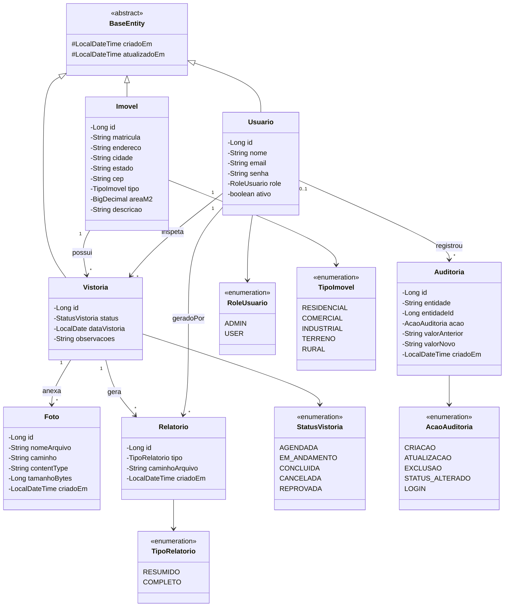
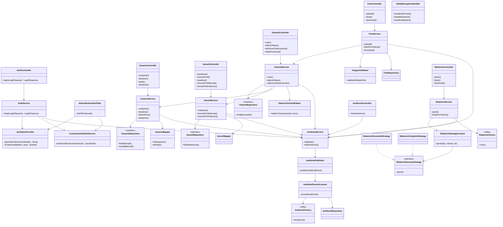

# SIGEVI — Diagrama de Classes

Diagramas para o trabalho de Engenharia de Software. Podem ser visualizados no GitHub, no VS Code (extensão Mermaid) ou em https://mermaid.live

---

## Figura 1 — Modelo de domínio (dados e relacionamentos)

Representa **o que o sistema armazena** e como as entidades se relacionam.



---

## Figura 2 — Camadas da aplicação por funcionalidade (RF)

Representa **como cada funcionalidade é implementada** nas camadas Controller → Service → Repository.



---

## Figura 3 — Visão simplificada (para slide da apresentação)

Versão resumida ligando **módulos funcionais** ao domínio.

```mermaid
classDiagram
    direction LR

  package Autenticacao {
    class AuthController
    class AuthService
    class JwtTokenProvider
  }

  package Usuarios {
    class UsuarioController
    class UsuarioService
  }

  package Imoveis {
    class ImovelController
    class ImovelService
    class Imovel
  }

  package Vistorias {
    class VistoriaController
    class VistoriaService
    class Vistoria
    class StatusVistoriaValidator
  }

  package Fotos {
    class FotoController
    class FotoService
    class Foto
    class ImagemValidator
  }

  package Relatorios {
    class RelatorioController
    class RelatorioService
    class RelatorioGeracaoStrategy
  }

  package Auditoria {
    class AuditoriaController
    class AuditoriaService
    class AuditoriaPublisher
  }

  AuthController --> AuthService
  UsuarioController --> UsuarioService
  ImovelController --> ImovelService
  VistoriaController --> VistoriaService
  FotoController --> FotoService
  RelatorioController --> RelatorioService
  AuditoriaController --> AuditoriaService

  ImovelService --> Imovel
  VistoriaService --> Vistoria
  FotoService --> Foto
  RelatorioService --> Relatorio
  Vistoria --> Imovel
  Vistoria --> Foto
  Vistoria --> Relatorio
```

---

## Legenda: funcionalidade × classes

| RF | Funcionalidade | Classes principais |
|----|----------------|-------------------|
| RF01 | Login JWT | `AuthController`, `AuthService`, `JwtTokenProvider`, `JwtAuthenticationFilter` |
| RF02 | Usuários | `UsuarioController`, `UsuarioService`, `UsuarioRepository` |
| RF03 | Imóveis | `ImovelController`, `ImovelService`, `Imovel`, `ImovelRepository` |
| RF04 | Vistorias | `VistoriaController`, `VistoriaService`, `Vistoria` |
| RF05 | Status vistoria | `StatusVistoriaValidator`, `VistoriaService.alterarStatus()` |
| RF06 | Fotos | `FotoController`, `FotoService`, `ImagemValidator`, `Foto` |
| RF07 | PDF | `RelatorioController`, `RelatorioService`, `Relatorio*Strategy` |
| RF08 | Auditoria | `AuditoriaService`, `AuditoriaPublisher`, `AuditoriaPersistListener` |

---

## Como exportar para PDF/imagem (entrega)

1. Copie o bloco Mermaid desejado  
2. Cole em https://mermaid.live  
3. Exporte como **PNG** ou **SVG**  
4. Inclua na pasta `docs/diagramas/` do repositório  
