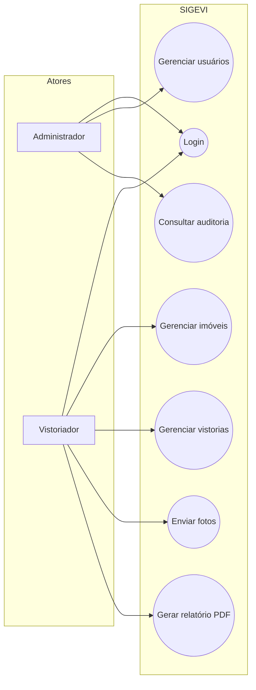
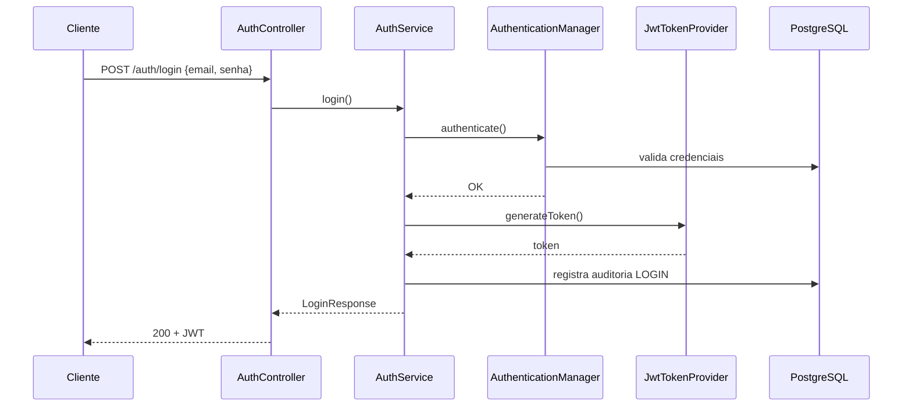
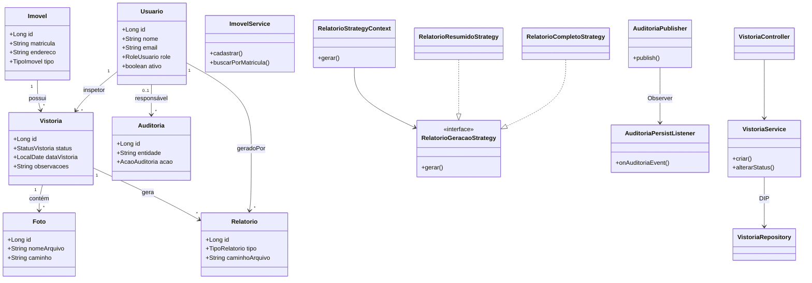
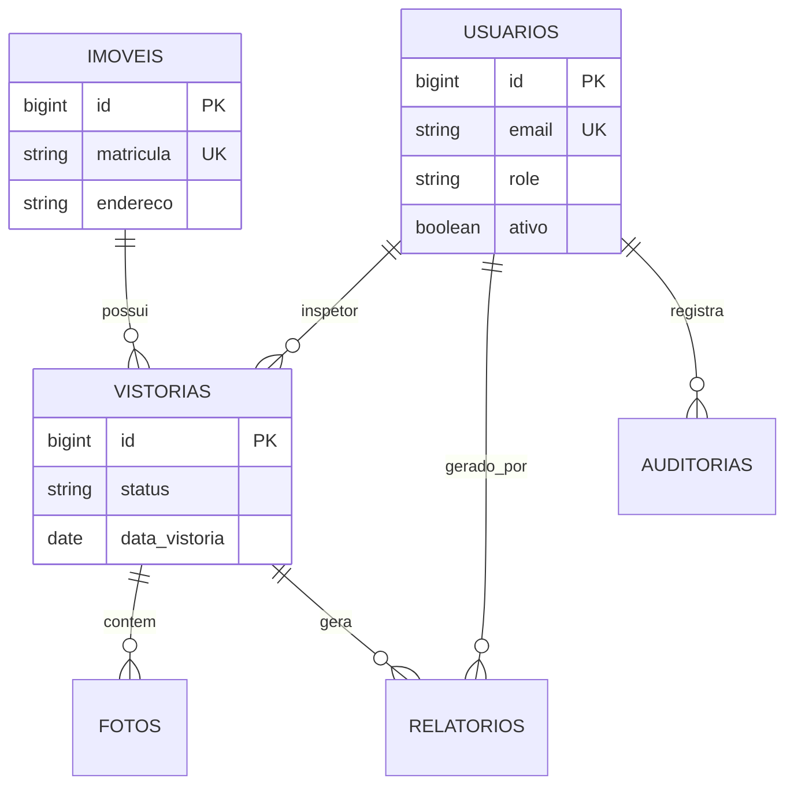

# SIGEVI — Documentação do Trabalho de Engenharia de Software

**Disciplina:** Engenharia de Software (prática e teoria)  
**Projeto:** SIGEVI — Sistema de Gestão de Vistorias Imobiliárias  
**Repositório:** https://github.com/Pedrochristovam/traballhofinal  
**Tipo de solução:** API REST back-end em Java  

> *Documento elaborado pelo grupo para descrever o problema, os requisitos, a modelagem e a implementação da solução. O código-fonte está na pasta `sigevi/` do repositório.*

---

## Sumário

1. [Identificação do problema](#1-identificação-do-problema)
2. [Levantamento e análise de requisitos](#2-levantamento-e-análise-de-requisitos)
3. [Escopo da solução](#3-escopo-da-solução)
4. [Modelagem da solução](#4-modelagem-da-solução)
5. [Arquitetura e implementação](#5-arquitetura-e-implementação)
6. [Princípios SOLID](#6-princípios-solid)
7. [Padrões de projeto](#7-padrões-de-projeto)
8. [Testes unitários](#8-testes-unitários)
9. [Como executar o sistema](#9-como-executar-o-sistema)
10. [Conclusão e trabalhos futuros](#10-conclusão-e-trabalhos-futuros)

---

## 1. Identificação do problema

### 1.1 Contexto

Durante conversas com uma **imobiliária de pequeno porte** (contexto familiar de um integrante do grupo), identificamos que o processo de **vistoria de imóveis** — comum em locações, vendas e entregas de chaves — ainda é realizado de forma **parcialmente manual**.

As vistorias precisam registrar o estado do imóvel (paredes, pintura, instalações), **fotografar** os cômodos, gerar um **relatório** para o proprietário ou inquilino e manter um **histórico** caso haja disputa depois da entrega das chaves.

### 1.2 Processo atual (antes da solução)

Hoje o fluxo funciona mais ou menos assim:

1. O corretor ou vistoriador agenda a visita por WhatsApp ou telefone.
2. No dia da vistoria, tira fotos com o celular.
3. Anota observações em **planilha Excel** ou em **papel**.
4. Envia fotos e textos por **e-mail** ou **WhatsApp** para o escritório.
5. Alguém do escritório monta o relatório “na mão” (Word/PDF) quando dá tempo.
6. Não existe um lugar único para consultar: *“quem alterou o status dessa vistoria?”* ou *“qual era a matrícula desse imóvel?”*.

### 1.3 Dificuldades encontradas

| Dificuldade | Impacto |
|-------------|---------|
| Informações espalhadas (WhatsApp, e-mail, planilha) | Perda de dados e retrabalho |
| Sem controle de acesso | Qualquer pessoa pode ver dados sensíveis |
| Sem histórico de alterações | Dificuldade em auditoria e conflitos |
| Relatório demorado para sair | Cliente insatisfeito, processo lento |
| Busca por imóvel frágil | Erros ao localizar matrícula ou endereço |

### 1.4 Usuários envolvidos (atores)

| Ator | Descrição |
|------|-----------|
| **Administrador** | Responsável pelo escritório; cadastra usuários e consulta auditoria |
| **Vistoriador (usuário comum)** | Realiza vistorias no imóvel, envia fotos e solicita relatórios |
| **Sistema** | Registra automaticamente logs de auditoria em operações relevantes |

### 1.5 Como a solução proposta ajuda

O **SIGEVI** centraliza em uma **API REST** o cadastro de imóveis, o ciclo de vida das vistorias, o upload de fotos, a geração de relatórios em PDF e o registro de auditoria. Com isso, o escritório passa a ter:

- um **único ponto** de consulta (via integrações futuras ou Swagger hoje);
- **autenticação** com perfis (admin x vistoriador);
- **rastreabilidade** das mudanças;
- **padronização** do fluxo de status da vistoria.

> **Importante:** conforme o enunciado da disciplina, **não pretendemos resolver 100% do problema da imobiliária**. Focamos no **núcleo back-end** que suporta o processo operacional das vistorias.

---

## 2. Levantamento e análise de requisitos

### 2.1 Como levantamos os requisitos

Utilizamos uma abordagem **ágil**, com inspiração nos conteúdos vistos em aula. As técnicas foram:

| Atividade | O que fizemos |
|-----------|----------------|
| **Entrevista semi-estruturada** | Conversa de ~40 min com o responsável da imobiliária (gestor) |
| **Observação informal** | Acompanhamento de como eles montam uma vistoria hoje (planilha + fotos no celular) |
| **Brainstorming no grupo** | Lista de funcionalidades mínimas viáveis para o prazo da disciplina |
| **Priorização MoSCoW** | Separação do que é Must / Should / Could para esta entrega |

### 2.2 Backlog priorizado (MoSCoW)

**Must (implementado nesta entrega):**

- Login com JWT e perfis ADMIN / USER  
- CRUD de usuários (admin)  
- Cadastro e busca de imóveis (por matrícula e endereço)  
- Criar vistoria vinculada ao imóvel  
- Alterar status e observações da vistoria  
- Upload de fotos com validação de formato  
- Gerar relatório PDF (resumido e completo)  
- Registrar auditoria das alterações  

**Should (fase futura):**

- Aplicativo mobile para o vistoriador  
- Notificações por e-mail quando a vistoria for concluída  

**Could (fase futura):**

- Assinatura digital do relatório  
- Integração com sistema comercial da imobiliária  

### 2.3 User Stories e critérios de aceitação

#### US01 — Autenticação

**Como** vistoriador ou administrador  
**Quero** fazer login na API  
**Para** acessar apenas as funcionalidades permitidas ao meu perfil  

**Critérios de aceite:**

- [ ] Dado e-mail e senha válidos, retorna token JWT e dados do usuário  
- [ ] Dado credenciais inválidas, retorna erro 401 padronizado  
- [ ] Rotas protegidas exigem header `Authorization: Bearer {token}`  

---

#### US02 — Cadastro de usuário (admin)

**Como** administrador  
**Quero** cadastrar novos vistoriadores  
**Para** controlar quem acessa o sistema  

**Critérios de aceite:**

- [ ] Apenas ADMIN pode criar usuário via POST `/usuarios`  
- [ ] E-mail duplicado retorna erro de negócio  
- [ ] Senha é armazenada com BCrypt  

---

#### US03 — Gestão de imóveis

**Como** vistoriador  
**Quero** cadastrar e buscar imóveis  
**Para** vincular corretamente cada vistoria  

**Critérios de aceite:**

- [ ] Cadastro exige matrícula, endereço, cidade, UF, CEP e tipo  
- [ ] Busca por matrícula retorna um imóvel  
- [ ] Busca por trecho do endereço retorna lista  

---

#### US04 — Ciclo da vistoria

**Como** vistoriador  
**Quero** criar uma vistoria e atualizar seu status  
**Para** acompanhar o andamento até a conclusão  

**Critérios de aceite:**

- [ ] Vistoria inicia com status `AGENDADA`  
- [ ] Transições inválidas de status são rejeitadas (ex.: CONCLUÍDA → AGENDADA)  
- [ ] É possível adicionar observações em texto  

---

#### US05 — Fotos da vistoria

**Como** vistoriador  
**Quero** enviar fotos da vistoria  
**Para** documentar visualmente o estado do imóvel  

**Critérios de aceite:**

- [ ] Aceita apenas JPEG, PNG ou WEBP (máx. 10 MB)  
- [ ] Foto fica vinculada à vistoria informada  
- [ ] É possível baixar a foto depois  

---

#### US06 — Relatório PDF

**Como** vistoriador  
**Quero** gerar relatório resumido ou completo  
**Para** entregar ao cliente sem montar manualmente no Word  

**Critérios de aceite:**

- [ ] Tipo `RESUMIDO` gera PDF com dados básicos  
- [ ] Tipo `COMPLETO` inclui observações e lista de fotos  
- [ ] Arquivo fica registrado no banco com caminho e autor  

---

#### US07 — Auditoria

**Como** administrador  
**Quero** consultar o histórico de alterações  
**Para** saber quem mudou o quê e quando  

**Critérios de aceite:**

- [ ] Operações de criação/alteração/status disparam registro de auditoria  
- [ ] GET `/auditorias/{entidade}/{id}` retorna lista ordenada por data  

---

### 2.4 Requisitos funcionais (resumo)

| ID | Requisito |
|----|-----------|
| RF01 | O sistema deve autenticar usuários e emitir token JWT |
| RF02 | O sistema deve permitir CRUD de usuários com desativação lógica |
| RF03 | O sistema deve cadastrar e consultar imóveis |
| RF04 | O sistema deve gerenciar vistorias vinculadas a imóveis e inspetores |
| RF05 | O sistema deve validar transições de status da vistoria |
| RF06 | O sistema deve receber upload de imagens da vistoria |
| RF07 | O sistema deve gerar relatórios PDF (resumido/completo) |
| RF08 | O sistema deve registrar trilha de auditoria |

### 2.5 Requisitos não funcionais

| ID | Requisito |
|----|-----------|
| RNF01 | Back-end em Java com Spring Boot |
| RNF02 | Persistência em PostgreSQL |
| RNF03 | API documentada via Swagger/OpenAPI |
| RNF04 | Senhas criptografadas com BCrypt |
| RNF05 | Respostas de erro padronizadas (JSON) |
| RNF06 | Testes unitários nas regras principais |
| RNF07 | Código organizado em camadas com SOLID e padrões de projeto |

---

## 3. Escopo da solução

### 3.1 O que está dentro do escopo (entrega atual)

- API REST completa para o fluxo principal de vistorias  
- Segurança JWT + roles  
- Banco PostgreSQL com migrations Flyway  
- Testes unitários em services, validators e JWT  
- Documentação técnica (`README.md`) e esta documentação acadêmica  

### 3.2 O que ficou fora do escopo (deliberadamente)

- Interface web ou mobile (front-end)  
- Envio de e-mail / push notification  
- Assinatura digital e armazenamento em nuvem (S3)  
- Módulo financeiro ou contratos de locação  

---

## 4. Modelagem da solução

### 4.1 Diagrama de casos de uso



### 4.2 Diagrama de sequência — Login JWT



### 4.3 Diagrama de classes (domínio e camadas principais)

> Representa as classes mais relevantes implementadas no pacote `br.com.sigevi`.



### 4.4 Modelo de dados (visão simplificada)



---

## 5. Arquitetura e implementação

### 5.1 Visão em camadas

Escolhemos uma arquitetura em **camadas** por ser didática, alinhada ao que vimos na disciplina, e suficiente para o porte do projeto:

```
Cliente HTTP
    ↓
Controller  → valida DTO (@Valid), devolve JSON
    ↓
Service     → regras de negócio, transações, auditoria
    ↓
Repository  → JPA / Spring Data
    ↓
PostgreSQL
```

### 5.2 Tecnologias utilizadas

| Tecnologia | Motivo da escolha |
|------------|-------------------|
| Java 21 | Versão moderna exigida pelo curso e mercado |
| Spring Boot 3 | Produtividade, ecossistema maduro |
| Spring Security + JWT | API stateless com autenticação |
| Spring Data JPA | Mapeamento objeto-relacional |
| PostgreSQL | Banco relacional robusto e gratuito |
| Flyway | Versionamento do schema |
| Lombok | Menos boilerplate nas entidades |
| OpenPDF | Geração de relatórios PDF |
| SpringDoc | Documentação Swagger automática |
| JUnit 5 + Mockito | Testes unitários isolados |

### 5.3 Estrutura de pacotes (código)

```
br.com.sigevi
├── controller/     → endpoints REST
├── service/        → regras de negócio
├── repository/     → acesso a dados
├── model/          → entidades JPA
├── dto/            → contratos da API
├── mapper/         → conversão Entity ↔ DTO
├── validator/      → validações específicas
├── exception/      → erros padronizados
├── security/       → JWT e filtros
├── config/         → beans de configuração
└── pattern/        → Strategy, Factory, Observer
```

### 5.4 Endpoints principais

| Método | Endpoint | Descrição |
|--------|----------|-----------|
| POST | `/api/auth/login` | Login (público) |
| POST | `/api/usuarios` | Cadastrar usuário (ADMIN) |
| GET | `/api/imoveis/matricula/{matricula}` | Buscar imóvel |
| POST | `/api/vistorias` | Criar vistoria |
| PATCH | `/api/vistorias/{id}/status` | Alterar status |
| POST | `/api/fotos/vistoria/{id}` | Upload de foto |
| POST | `/api/relatorios/vistoria/{id}` | Gerar PDF |
| GET | `/api/auditorias/{entidade}/{id}` | Histórico (ADMIN) |

Documentação interativa: `http://localhost:8080/api/swagger-ui.html`

---

## 6. Princípios SOLID

Explicamos abaixo como tentamos aplicar cada princípio **na prática**, com exemplos do nosso código.

### S — Single Responsibility Principle

Cada classe tem uma responsabilidade clara:

- `ImagemValidator` → só valida arquivo de imagem  
- `StatusVistoriaValidator` → só valida transição de status  
- `AuthController` → só recebe HTTP de login e delega  
- `VistoriaService` → concentra regras de vistoria  

*Por que isso importa?* Fica mais fácil testar e manter sem que uma mudança em upload de foto quebre autenticação.

### O — Open/Closed Principle

O módulo de relatórios está **aberto para extensão** (nova estratégia de PDF) e **fechado para alteração** no `RelatorioStrategyContext`:

- Para criar outro tipo de relatório, basta implementar `RelatorioGeracaoStrategy`  
- Não precisamos ficar alterando um `switch` gigante no service  

### L — Liskov Substitution Principle

`RelatorioResumidoStrategy` e `RelatorioCompletoStrategy` podem ser substituídas uma pela outra onde a interface `RelatorioGeracaoStrategy` é esperada, sem quebrar o contexto.

### I — Interface Segregation Principle

`AuditoriaListener` expõe apenas `onAuditoriaEvent(...)`. Quem implementa o listener não é obrigado a métodos que não usa.

### D — Dependency Inversion Principle

Services dependem de **interfaces** `*Repository` (abstração do Spring Data), não de JDBC manual. O Spring injeta a implementação em tempo de execução.

---

## 7. Padrões de projeto

O enunciado pedia padrões **criacionais, estruturais e comportamentais** quando fizer sentido. Justificamos os que usamos:

### 7.1 Padrões criacionais

| Padrão | Onde | Justificativa |
|--------|------|---------------|
| **Factory Method** | `RelatorioFactory`, `AuditoriaFactory` | Centraliza criação de objetos complexos com campos obrigatórios |
| **Builder** | Lombok `@Builder` em `Usuario`, `Vistoria`, etc. | Construção legível de entidades com muitos campos |
| **Singleton** | `JwtPropertiesHolder` (+ beans Spring) | Uma instância de configuração JWT no contexto da aplicação |

### 7.2 Padrões estruturais

| Padrão | Onde | Justificativa |
|--------|------|---------------|
| **DTO (Data Transfer Object)** | pacote `dto/` + `mapper/` | Separa modelo de persistência do contrato exposto na API — evita expor senha e lazy loading |
| **Facade** (implícito) | classes `*Service` | Oferecem interface simples para controllers, escondendo repositórios, validadores e auditoria |

### 7.3 Padrões comportamentais

| Padrão | Onde | Justificativa |
|--------|------|---------------|
| **Strategy** | `RelatorioResumidoStrategy`, `RelatorioCompletoStrategy` | Algoritmos diferentes de PDF intercambiáveis em runtime |
| **Observer** | `AuditoriaPublisher` → `AuditoriaPersistListener` | Quando algo muda no sistema, “ouvintes” gravam auditoria sem acoplar todos os services ao banco de auditoria |
| **Repository** | `*Repository` (Spring Data) | Abstrai persistência; services não escrevem SQL |

---

## 8. Testes unitários

Implementamos testes com **JUnit 5** e **Mockito** para validar comportamento sem subir o banco:

| Classe de teste | O que valida |
|-----------------|--------------|
| `StatusVistoriaValidatorTest` | Transições permitidas e bloqueadas |
| `ImagemValidatorTest` | Formato e arquivo vazio |
| `UsuarioServiceTest` | E-mail duplicado e cadastro OK |
| `ImovelServiceTest` | Matrícula duplicada e cadastro OK |
| `VistoriaServiceTest` | Alteração de status e not found |
| `AuthServiceTest` | Login OK e credenciais inválidas |
| `JwtTokenProviderTest` | Geração e validação do token |

**Como rodar:**

```bash
cd sigevi
mvn test
```

Sabemos que ainda dá para aumentar a cobertura (ex.: `FotoService`, `RelatorioService`), mas priorizamos as **regras de negócio mais críticas** dentro do tempo do trabalho.

---

## 9. Como executar o sistema

### Pré-requisitos

- JDK 21  
- Maven 3.9+  
- PostgreSQL 15+  

### Banco de dados

```bash
# Executar como superuser PostgreSQL
psql -U postgres -f sigevi/scripts/init-database.sql
```

### Configuração

Editar `sigevi/src/main/resources/application.yml` se necessário (usuário/senha do banco).

### Subir a API

```bash
cd sigevi
mvn spring-boot:run
```

### Usuário padrão (criado automaticamente no 1º start)

| Campo | Valor |
|-------|-------|
| E-mail | `admin@sigevi.com` |
| Senha | `Admin@123` |

### Testar no Swagger

1. Acessar `http://localhost:8080/api/swagger-ui.html`  
2. Fazer login em `POST /auth/login`  
3. Clicar em **Authorize** e colar: `Bearer {token}`  
4. Testar os demais endpoints  

---

## 10. Conclusão e trabalhos futuros

### 10.1 Conclusão

Conseguimos modelar e implementar uma **parte relevante** do problema real da imobiliária: o fluxo de vistorias com autenticação, imóveis, fotos, relatórios e auditoria. A solução está organizada em camadas, usa **SOLID**, aplica **padrões de projeto** de forma justificável e possui **testes unitários** nas principais regras.

Este trabalho nos ajudou a ligar a teoria da disciplina (requisitos, modelagem, padrões) com uma implementação concreta em Java, que é exatamente o que o enunciado pedia.

### 10.2 Trabalhos futuros

- Front-end web ou app mobile para o vistoriador em campo  
- Notificações automáticas ao concluir vistoria  
- Armazenamento de fotos em nuvem (S3/MinIO)  
- Mais testes de integração com Testcontainers  
- Paginação e filtros avançados nas listagens  

---

## Referências rápidas do grupo

| Item | Link / local |
|------|----------------|
| Repositório GitHub | https://github.com/Pedrochristovam/traballhofinal |
| Código da API | pasta `sigevi/` |
| README técnico | `sigevi/README.md` |
| Este documento | `docs/DOCUMENTACAO-SIGEVI.md` |

---

*Documento sujeito a revisões conforme feedback do professor e evolução do repositório.*
