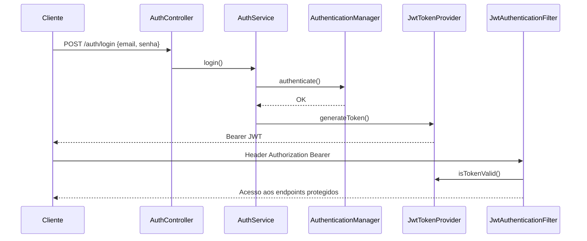

# SIGEVI — Sistema de Gestão de Vistorias Imobiliárias

API REST corporativa em **Java 21** + **Spring Boot 3** para gestão de imóveis, vistorias, fotos, relatórios PDF e auditoria.

## Stack

| Tecnologia | Uso |
|------------|-----|
| Java 21 | Linguagem |
| Spring Boot 3.3 | Framework |
| Spring Security + JWT | Autenticação |
| Spring Data JPA | Persistência |
| PostgreSQL + Flyway | Banco e migrations |
| Lombok | Redução de boilerplate |
| OpenPDF | Geração de PDF |
| SpringDoc OpenAPI | Swagger |
| JUnit 5 + Mockito | Testes unitários |

## Estrutura de pastas

```
sigevi/
├── src/main/java/br/com/sigevi/
│   ├── config/          # Security, Swagger, Observer wiring
│   ├── controller/      # REST endpoints
│   ├── dto/             # Request/Response (DTO Pattern)
│   ├── exception/       # Exceções + handler global
│   ├── mapper/          # Conversão Entity ↔ DTO
│   ├── model/           # Entidades JPA + enums
│   ├── pattern/         # Strategy, Factory, Observer
│   ├── repository/      # Repository Pattern (Spring Data)
│   ├── security/        # JWT, filtros, UserDetails
│   ├── service/         # Regras de negócio
│   └── validator/       # Validações de domínio
├── src/main/resources/
│   ├── application.yml
│   └── db/migration/    # Flyway V1, V2
├── src/test/java/       # Testes unitários
└── scripts/             # SQL manual PostgreSQL
```

## Arquitetura

Arquitetura em **camadas** com separação clara:

```
Cliente → Controller → Service → Repository → PostgreSQL
              ↓           ↓
            DTO       Domain/Entity
```

- **Controllers**: apenas HTTP, validação de entrada (`@Valid`), delegação.
- **Services**: regras de negócio, transações, auditoria.
- **Repositories**: acesso a dados (DIP — services dependem de abstrações).
- **DTOs**: contrato da API desacoplado das entidades JPA.

## SOLID no projeto

| Princípio | Aplicação |
|-----------|-----------|
| **SRP** | `ImagemValidator`, `StatusVistoriaValidator`, controllers finos, services por agregado |
| **OCP** | `RelatorioGeracaoStrategy` — novos tipos de relatório sem alterar o contexto |
| **LSP** | Estratégias de relatório intercambiáveis via interface comum |
| **ISP** | `AuditoriaListener` com contrato mínimo (`onAuditoriaEvent`) |
| **DIP** | Services injetam interfaces `*Repository`; Security usa `UserDetailsService` |

## Design Patterns

| Pattern | Onde |
|---------|------|
| **Repository** | `repository/*Repository.java` |
| **DTO** | `dto/request`, `dto/response`, `mapper/*` |
| **Strategy** | `pattern/strategy/Relatorio*Strategy` |
| **Factory** | `pattern/factory/RelatorioFactory`, `AuditoriaFactory` |
| **Builder** | Lombok `@Builder` nas entidades |
| **Singleton** | `JwtPropertiesHolder` (bean singleton Spring) |
| **Observer** | `AuditoriaPublisher` + `AuditoriaPersistListener` |

## Relacionamentos JPA

```
Usuario 1───* Vistoria (inspetor)
Imovel  1───* Vistoria
Vistoria 1──* Foto
Vistoria 1──* Relatorio
Usuario 1───* Relatorio (geradoPor)
Usuario 1───* Auditoria (opcional)
```

## Fluxo de autenticação JWT



## Endpoints REST

Base: `http://localhost:8080/api`

### Autenticação (público)
| Método | Endpoint | Descrição |
|--------|----------|-----------|
| POST | `/auth/login` | Login → JWT |

### Usuários (JWT — cadastro ADMIN)
| Método | Endpoint | Descrição |
|--------|----------|-----------|
| POST | `/usuarios` | Cadastrar |
| PUT | `/usuarios/{id}` | Atualizar |
| GET | `/usuarios` | Listar ativos |
| PATCH | `/usuarios/{id}/desativar` | Desativar |

### Imóveis
| Método | Endpoint | Descrição |
|--------|----------|-----------|
| POST | `/imoveis` | Cadastrar |
| GET | `/imoveis/{id}` | Buscar por ID |
| PUT | `/imoveis/{id}` | Atualizar |
| GET | `/imoveis/matricula/{matricula}` | Por matrícula |
| GET | `/imoveis/endereco?q=` | Por endereço |

### Vistorias
| Método | Endpoint | Descrição |
|--------|----------|-----------|
| POST | `/vistorias` | Criar |
| GET | `/vistorias/{id}` | Buscar |
| PATCH | `/vistorias/{id}/status` | Alterar status |
| PATCH | `/vistorias/{id}/observacoes` | Observações |
| GET | `/vistorias/imovel/{imovelId}` | Listar por imóvel |

### Fotos
| Método | Endpoint | Descrição |
|--------|----------|-----------|
| POST | `/fotos/vistoria/{id}` | Upload multipart |
| GET | `/fotos/vistoria/{id}` | Listar |
| GET | `/fotos/{id}/download` | Download |

### Relatórios
| Método | Endpoint | Descrição |
|--------|----------|-----------|
| POST | `/relatorios/vistoria/{id}` | Gerar PDF `{tipo: RESUMIDO\|COMPLETO}` |
| GET | `/relatorios/vistoria/{id}` | Listar |
| GET | `/relatorios/{id}/download` | Download PDF |

### Auditoria (ADMIN)
| Método | Endpoint | Descrição |
|--------|----------|-----------|
| GET | `/auditorias/{entidade}/{entidadeId}` | Histórico |

## Swagger

- UI: http://localhost:8080/api/swagger-ui.html
- OpenAPI: http://localhost:8080/api/v3/api-docs

Use **Authorize** com: `Bearer <seu-jwt>`.

## Como executar

### Pré-requisitos
- JDK 21
- Maven 3.9+
- PostgreSQL 15+

### Banco
```bash
psql -U postgres -f scripts/init-database.sql
```

### Aplicação
```bash
cd sigevi
mvn spring-boot:run
```

### Testes
```bash
mvn test
```

### Usuário inicial (Flyway V2)
- **Email:** `admin@sigevi.com`
- **Senha:** `Admin@123`

## Variáveis de ambiente

| Variável | Descrição |
|----------|-----------|
| `JWT_SECRET` | Chave Base64 para assinatura JWT |
| `UPLOAD_DIR` | Diretório de uploads |

## Evolução sugerida

- Paginação (`Pageable`) nos listagens
- Refresh token
- Armazenamento S3 para fotos
- Eventos assíncronos (Spring Events / Kafka) na auditoria
- Testes de integração com Testcontainers
